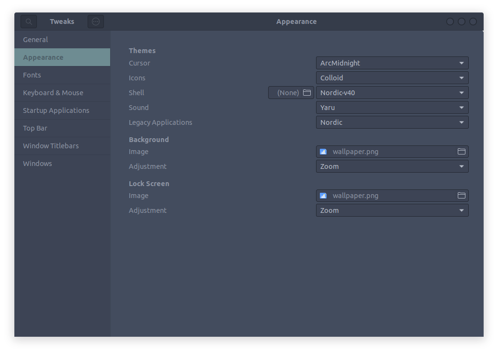

# Ubuntu 22.04 Setup


## 0. Network Prepare

I think it's necessary to install some tools to confirm that we can easily connect to github and raw.githubusercontent.com. I use `clash for windows pkg` and configurate proxy maually. And I will add raw.githubusercontent.com ip to hosts (you can find details on `./dotfiles/hosts`). Here is the parser for lastest clash to solve timeout problem (You also can find it in clash_for_windows_pkg issues).

```bash
parsers: # array
  - reg: .+ # 正则匹配任何订阅链接，你可以改为更精确的链接规则，如：https://sub.example.com/.+
    code: |
      module.exports.parse = async (raw, { axios, yaml, notify, console }, { name, url, interval, selected }) => {
        const obj = yaml.parse(raw)
        obj["proxies"].forEach(
          function(ele){
            if(ele['type']!='vmess'||ele['network']!='ws'||ele['ws-opts']){return}
            ele['ws-opts']={}
            ele['ws-opts']['path']=ele['ws-path']
            ele['ws-opts']['headers']={}
            ele['ws-opts']['headers']['Host']=ele['ws-headers']['Host']
            delete ele['ws-path']
            delete ele['ws-headers']
          }
        )
        return yaml.stringify(obj)
      }
```

## 1. Usage

It's easy to run `setup.sh`  and select your favorite option to install software and configure  settings. **Do not use `sudo ./setup.sh`**

```bash
# clone env-setup project
git clone https://github.com/CT-Yao/env-setup.git

cd env-setup

# ask execution permission
sudo chmod u+x setup.ch

# run setup script
./setup.sh
```

## 2. Configuration

We need to set up some properties manually. Here are some configuration you should to set up.

### 2.1 Fcitx5

We may meet some problems if we use `fcitx` and `sogou-pinyin` input method on Ubuntu 22.04. This script uses `fcitx5` and its`Pinyin` input, you can set up it after reboot the computer. And you need to add configuration to`/etc/environment` (you can find details on `./dotfiles/environment`). 

### 2.2 ZSH & oh-my-zsh

You can replace `~/.zshrc` with the`./dotfiles/.zshrc` . 

### 2.3 Tmux

You can replace `~/.tmux.conf` with the `./dotfiles/.zshrc` , and execute `prefix+I` to install some tmux plugins.  

### 2.4 Gnome

#### Extensions

Find `GNOME Shell integration` extension on `Chrome Web Store` and install gnome extensions. Here are some useful extensions in my opinions.
- User Themes: Used to load shell themes.
- Extension List: A simple gnome shell extension manager
- OpenWeather: A beautiful extension which can display weather information
- Hide Top Bar: Hides the top bar automatically
- Vitals: A useful extension which can display computer info(temperature. voltage and so on)
- Transparent Shell: Make the main shell components transparent

#### Dock

I use the default dock on Ubuntu 22.04. We can set up the dock properties on `Settings-Appearance`.

#### Gnome Tweaks

- **GNOME Terminal Theme**: I use Nord theme for terminal. You can set up that theme in `Terminal-Perferences-Profiles-Nord`.

- **Plymouth**: I use vortex-ubuntu-plymouth-theme.

- **Tweaks**: We use `gnome-tweaks` to set up themes, icons, cursors and so on. My script will unzip theme files to `~/.themes` and `~/.icons` automatically. My personal configurations as follows

  

### 2.5 rEFInd

I use rEFInd as boot manager. After install it by the script, you should to modify some parameters as the following statement shows (You need to git clone refind-ambience theme and copy files to /boot/efi/EFI/refind/themes/):

- Edit`/boot/efi/EFI/refind/refind.conf` and add configurations at the end.

  ```bash
  include themes/refind-ambience/theme.conf
  
  dont_scan_dirs \efi\boot
  scan_all_linux_kernels false
  ```

- Set start time as 0

  ```bash
  # edit /etc/grub.d/30_os-prober
  set timeout=0
  
  # edit /etc/default/grub
  GRUB_TIMEOUT=0
  ```

- Execute `sudo update-grub`

### 2.6 Neovim

To be continued...
