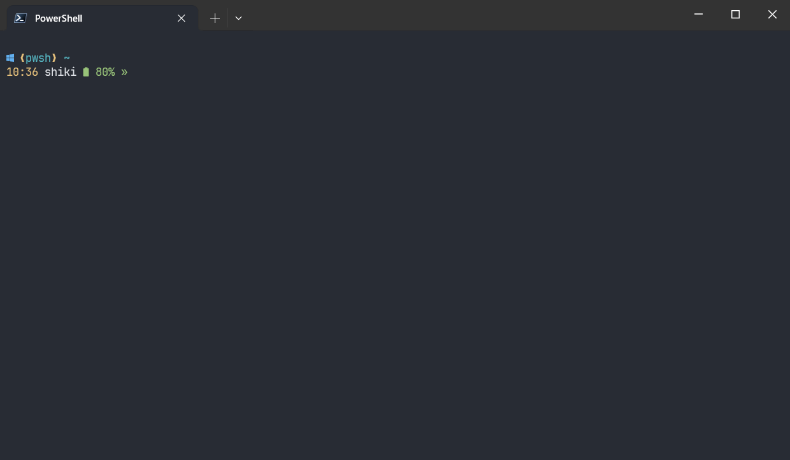
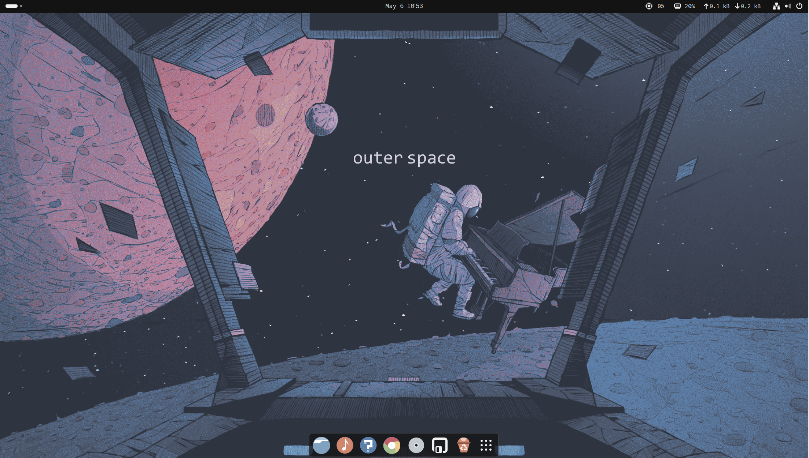

This (repo)[https://github.com/R-Sh1ki/env-setup.git] contians personalized configurations for different OS (Windows and Ubuntu).
By selecting the corresponding branch, we can quickly configure it via the setup script.

```bash
# windows scripts
git clone --branch win https://github.com/R-Sh1ki/env-setup.git && cd env-setup

# ubuntu scripts
git clone --branch ubuntu https://github.com/R-Sh1ki/env-setup.git && cd env-setup
```


## Quick Start

### Windows
For windows, there is only a simple configuration of the PowerShell terminal here. 
We choose `starship` to personalize the terminal, you need to pre-install (Nerd Font)[https://www.nerdfonts.com/] to support the display of some symbols.
Then, open the terminal as administrator and execute `setup.ps1`


### Ubuntu
It's easy to run `setup.sh` and select your favorite option to install software and configure settings. **Do not use `sudo ./setup.sh`**

```bash
sudo chmod u+x setup.sh

./setup.sh
```

With the setup script, you can choose to replace the ubuntu software source with USTC mirrors and automatically update the software, uninstall uncommon software and install necessary software (Chrome, VSCode, etc.). The script also includes my `ZSH` and `TMUX` configurations.

In the future, I will update the deployment scripts for more development environments.

